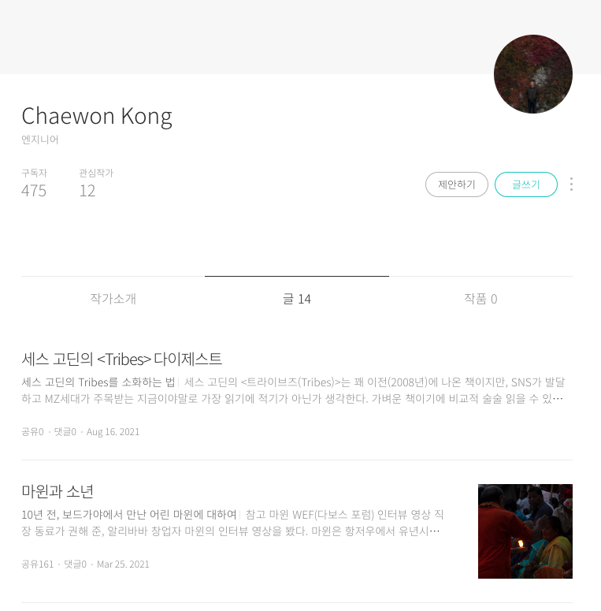

## 공채원 (Chaewon Kong)

뭐든 만들 수 있는 개발자를 꿈꾸는 프론트엔드 엔지니어 입니다. 뚝딱뚝딱 만들고 사람들이 실제로 쓰는 모습을 보면서 행복을 느낍니다. JavaScript로 할 수 있는 모든 것을 해보자는 목표를 가지고 개발을 이어가고 있습니다. React를 활용한 웹 개발과 React Native를 활용한 모바일 앱 개발을 주로 하고 있습니다.

## Career

- (Former) Web Engineer at **Banksalad**, Since March, 2020.
- (Current) Web Engineer at **Lefthanders**, developing _Rollingpaper_, a million user service.

## Technical Skills Summary

- Languages: JavaScript(전문), TypeScript, Python
- Frontend(전문): React, React Native, Electron
- Backend(보통): Node.js, MySQL, MongoDB

## Projects

### 롤링페이퍼 (2020~)

사용자들끼리 롤링페이퍼를 작성해 주고받을 수 있는 웹 SNS입니다.
순 방문자(UV) 기준 **473만** 방문자를 달성했습니다.

- [롤링페이퍼 LINK](https://rollingpaper.site)

### 막차 (2019)

쉽고 빠르게 막차를 검색할 수 있는 앱입니다. React Native로 개발되었습니다.
iOS / Android **1만** 다운로드 달성.

- [막차 - Apple App Store LINK](https://apps.apple.com/kr/app/막차/id1480522844)
- [막차 - Google Play Store LINK](https://play.google.com/store/apps/details?id=com.native_makkcha)

### 하루시작 (2018)

하루 하나의 주제를 던져주고 한 편의 시를 쓰게 하는 웹앱입니다.

- [하루시작-하루 한편 시쓰기](https://harusijak.com)

### 아두이노 드론 프로젝트 (2016)

<iframe width="672" height="378" max-width='100%' src="https://www.youtube.com/embed/-yl7HBhhvFA" title="YouTube video player" frameborder="0" allow="accelerometer; autoplay; clipboard-write; encrypted-media; gyroscope; picture-in-picture" allowfullscreen></iframe>

- Arduino를 활용한 간단한 드론개발. Arduino 나노를 활용했으며, 오픈소스인 ArduPilot을 활용하고 매개변수를 조정해 비행해 성공.

## Language

- 영어: 업무상 의사소통 가능(TOEIC 950, TOEIC SPEAKING Lv.7)

### Awards

- **과기정통부 SW마에스트로** 10기 수료 및 최종 인증자 선정 (2019)
- **Junction X NBP(Naver Business Platform)** 해커톤 애프터 프로젝트 수료 (2019)

## Brunch

테크와 관련되지 않은 글쓰기를 위해 [브런치](https://brunch.co.kr/@chaewonkong)를 이용하고 있습니다.

- [나는 서울의 택시운전수](https://brunch.co.kr/@chaewonkong/16): 4차산업혁명 시대에 대한민국의 택시 기사로 살아간다는 것. 퇴근 길 우연히 택시기사님과 나눈 대화를 정리해 봤습니다. 택시앱과 내비게이션의 발달은 인간을 기계를 보조하는 존재로 전락시켰는데요. 택시기사님들이 느끼는 박탈감은 작지 않았습니다.
- [마윈과 소년](https://brunch.co.kr/@chaewonkong/20): 마윈의 인터뷰 영상을 보다가, 10년 전 인도 보드가야에서 만났던 소년을 떠올려 봤습니다. 똑똑하고 의욕적이지만, 부유하지는 않았던 소년. 소년은 어떻게 자랐을까요.

## Contact

- [email: chaewonkong@gmail.com](mailto://chaewonkong@gmail.com)
- [linked-in](https://www.linkedin.com/in/chaewon-kong-958986119/)
